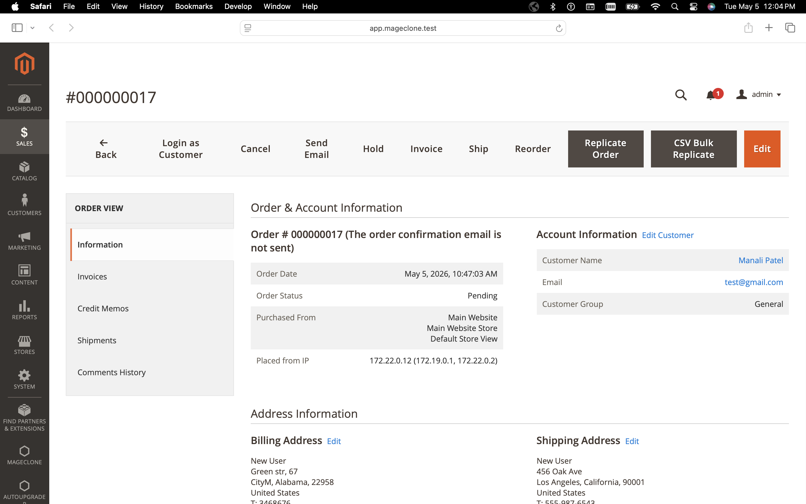
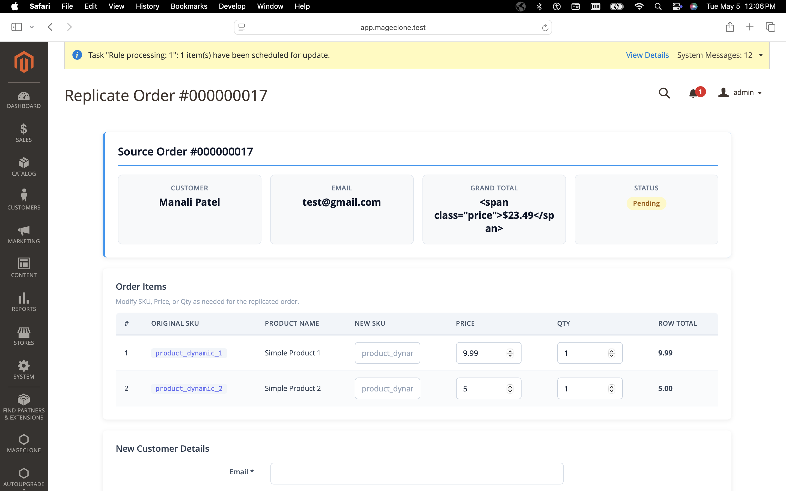
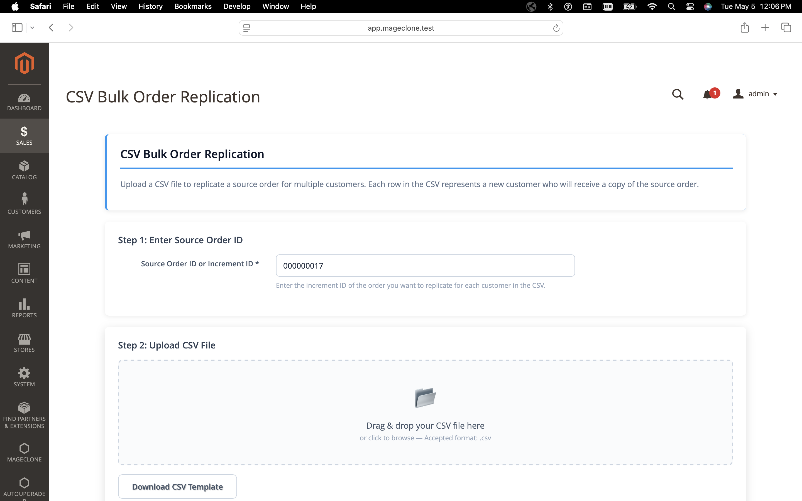
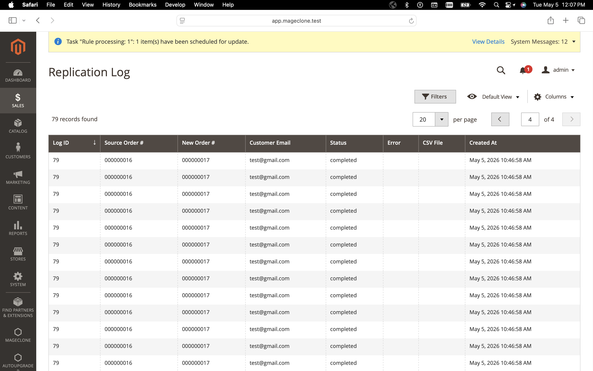

# MageClone Order Replicator — Magento 2 Module

**Version:** 1.0.0
**Compatibility:** Magento 2.4.x / Adobe Commerce
**PHP:** 8.1+
**License:** MIT

---

## Screenshots

### Order View — Replicate Buttons


### Replicate Order Form


### CSV Bulk Upload (Prefilled Order ID)


### Replication Log


---

## What It Does

MageClone Order Replicator is a Magento 2 admin module that lets you **clone any existing order** and create a new order for a different customer — with the ability to modify SKUs, prices, quantities, shipping method, and payment method per order.

It also supports **bulk CSV upload** to replicate one source order across hundreds of customers at once.

---

## Key Features

| Feature | Description |
|---------|-------------|
| **1-Click Order Clone** | Select any existing order and replicate it for a new customer |
| **SKU/Price/Qty Override** | Change product SKUs, prices, or quantities on the replicated order |
| **Per-Customer Shipping Method** | Set a different shipping method per replicated order |
| **Per-Customer Payment Method** | Set a different payment method per replicated order |
| **CSV Bulk Upload** | Upload a CSV with customer emails + addresses to create orders in bulk |
| **Auto Customer Creation** | Optionally auto-create customer accounts for new emails |
| **Replication Log** | Full audit trail of all replicated orders with status tracking |
| **ACL Permissions** | Granular admin role permissions (view, replicate, CSV upload, config) |
| **Composer Support** | Install via `composer require` |

---

## Business Use Cases

### B2B Wholesale Reordering
Sales reps can clone a previous wholesale order and assign it to a new buyer in seconds — no need to manually re-enter 50+ line items.

### Corporate Gift Orders
A company orders 200 identical gift boxes for employees. Upload a CSV with 200 employee names/addresses, and the module creates 200 individual orders from one source order.

### Franchise / Multi-Location Distribution
HQ creates a "template" order, then replicates it to 50 franchise locations. Each location can have different shipping/payment methods.

### Phone Order Desk
"I want the same thing Customer X ordered, but change the widget to the blue version" → Clone, modify SKU, submit. Done in 30 seconds.

### Subscription-Like Repeat Orders
For stores without auto-subscription, staff can quickly replicate last month's order for regular customers.

---

## Installation

### Method 1: Composer (Recommended — Private GitLab Repo)

```bash
# Step 1: Create a GitLab Personal Access Token with read_repository scope
# Go to: https://gitlab.com/-/user_settings/personal_access_tokens

# Step 2: Configure composer auth for GitLab
composer config --global --auth gitlab-token.gitlab.com YOUR_PERSONAL_ACCESS_TOKEN

# Step 3: Add the private GitLab repository
composer config repositories.mageclone '{"type": "vcs", "url": "git@gitlab.com:manali222/manali222-project.git"}'

# Step 4: Install
composer require mageclone/module-order-replicator:^1.0

# Step 5: Enable and setup
bin/magento module:enable MageClone_OrderReplicator
bin/magento setup:upgrade
bin/magento setup:di:compile
bin/magento cache:flush
```

> **Note:** This is a private repository. You need SSH access or a GitLab Personal Access Token to install via Composer.

### Method 2: Manual Installation

```bash
# Copy module to app/code
cp -r MageClone/ <magento-root>/app/code/

# Enable and setup
bin/magento module:enable MageClone_OrderReplicator
bin/magento setup:upgrade
bin/magento setup:di:compile
bin/magento cache:flush
```

### Method 3: Warden (Local Development)

```bash
# From your Warden project root
warden env exec php-fpm bin/magento module:enable MageClone_OrderReplicator
warden env exec php-fpm bin/magento setup:upgrade
warden env exec php-fpm bin/magento setup:di:compile
warden env exec php-fpm bin/magento cache:flush
```

---

## Configuration

Navigate to **Stores → Configuration → Sales → Order Replicator**

### General Settings

| Setting | Default | Description |
|---------|---------|-------------|
| Enable Module | No | Must be enabled to use |
| Send Order Confirmation Email | No | Email new customer on order creation |
| Default Order Status | Pending | Status for new replicated orders |
| Default Payment Method | `checkmo` | Fallback payment method code |
| Auto-Create Customer Account | No | Create customer account if email is new |

### CSV Settings

| Setting | Default | Description |
|---------|---------|-------------|
| Maximum CSV Rows | 500 | Max rows per CSV upload |
| CSV Delimiter | `,` | Column separator character |

---

## Usage Guide

### Single Order Replication (Admin UI)

1. Go to **Sales → Orders** and open any order
2. Click **"Replicate Order"** in the button bar at the top
3. On the replication page you'll see:
   - **Source Order Summary** — original order details
   - **Order Items Table** — editable SKU, price, qty per line item
   - **New Customer Details** — email, first name, last name (required)
   - **Billing Address** — leave blank to use source order's address
   - **Shipping Address** — leave blank to use source order's address
   - **Shipping & Payment Method** — override per this customer or use source order defaults
5. Click **"Replicate Order"**
6. See success message with link to the new order

### CSV Bulk Replication

1. From any order view, click **"CSV Bulk Replicate"** (the source order ID is prefilled), or go to **Sales → Order Replicator → CSV Bulk Replication**
2. Enter the **Source Order ID** if not already prefilled
3. Download the CSV template
4. Fill in customer details (one row per new order)
5. Upload the CSV and click **"Process CSV & Create Orders"**
6. See results: success count, failed count, error details

### Replication Log

Go to **Sales → Order Replicator → Replication Log** to see full audit trail of all replication attempts with:
- Source order # → New order #
- Customer email
- Status (pending/processing/completed/failed)
- Error messages for failed attempts
- Timestamp

---

## CSV Template Reference

### Required Columns

| Column | Description |
|--------|-------------|
| `customer_email` | New customer's email address |
| `customer_firstname` | First name |
| `customer_lastname` | Last name |

### Optional Address Columns

| Column | Description |
|--------|-------------|
| `billing_street` | Street address (uses source order if blank) |
| `billing_city` | City |
| `billing_region` | State/Region name |
| `billing_region_id` | Magento region ID |
| `billing_postcode` | ZIP/Postal code |
| `billing_country_id` | Country code (US, GB, etc.) |
| `billing_telephone` | Phone number |
| `shipping_street` | Shipping street (falls back to billing) |
| `shipping_city` | Shipping city |
| `shipping_region` | Shipping state/region |
| `shipping_region_id` | Shipping region ID |
| `shipping_postcode` | Shipping ZIP |
| `shipping_country_id` | Shipping country |
| `shipping_telephone` | Shipping phone |

### Optional Item Override Columns

| Column | Description |
|--------|-------------|
| `override_sku` | Pipe-separated new SKUs (e.g., `SKU-A\|SKU-B`) |
| `override_price` | Pipe-separated prices matching SKU order |
| `override_qty` | Pipe-separated quantities matching SKU order |

### Sample CSV

```csv
customer_email,customer_firstname,customer_lastname,billing_street,billing_city,billing_region,billing_postcode,billing_country_id,billing_telephone
john@example.com,John,Doe,123 Main St,New York,New York,10001,US,555-123-4567
jane@example.com,Jane,Smith,456 Oak Ave,Los Angeles,California,90001,US,555-987-6543
```

---

## ACL Permissions

| Resource | Description |
|----------|-------------|
| `MageClone_OrderReplicator::order_replicator` | Parent resource |
| `MageClone_OrderReplicator::view` | View orders and replication log |
| `MageClone_OrderReplicator::replicate` | Execute order replication |
| `MageClone_OrderReplicator::csv_upload` | Upload CSV for bulk replication |
| `MageClone_OrderReplicator::config` | Module configuration |

To set permissions: **System → Permissions → User Roles → [Role] → Role Resources**

---

## Admin Menu Location

```
Sales
├── Orders                      (native Magento grid — each order has Replicate buttons)
└── Order Replicator
    ├── CSV Bulk Replication     (upload CSV page)
    └── Replication Log          (audit log grid)
```

---

## Technical Architecture

### Module Structure

```
MageClone/OrderReplicator/
├── registration.php                          # Module registration
├── composer.json                             # Composer package definition
├── phpunit.xml                               # PHPUnit config
├── etc/
│   ├── module.xml                            # Module declaration + dependencies
│   ├── di.xml                                # Dependency injection config
│   ├── acl.xml                               # Admin permissions
│   ├── db_schema.xml                         # Database table definition
│   └── adminhtml/
│       ├── routes.xml                        # Admin routes
│       ├── menu.xml                          # Admin menu items
│       └── system.xml                        # Store configuration fields
├── Api/
│   └── OrderReplicatorInterface.php          # Service contract
├── Model/
│   ├── OrderReplicator.php                   # Core replication logic
│   ├── CsvProcessor.php                      # CSV parsing + batch processing
│   ├── ReplicationLog.php                    # Log model
│   └── ResourceModel/
│       └── ReplicationLog/
│           ├── ReplicationLog.php            # Resource model
│           └── Collection.php                # Collection
├── Controller/Adminhtml/
│   ├── Order/
│   │   ├── Index.php                         # Order grid page
│   │   ├── View.php                          # Order replication form
│   │   └── Replicate.php                     # AJAX replication endpoint
│   ├── Csv/
│   │   ├── Upload.php                        # CSV upload page
│   │   ├── Process.php                       # CSV processing endpoint
│   │   └── DownloadTemplate.php              # Template download
│   └── Log/
│       └── Index.php                         # Replication log grid
├── Block/Adminhtml/
│   ├── Order/ViewOrder.php                   # Order view block
│   └── Csv/Upload.php                        # CSV upload block
├── Ui/Component/Listing/Column/
│   └── Actions.php                           # Grid action column
├── Helper/
│   └── Config.php                            # Configuration helper
├── view/adminhtml/
│   ├── layout/                               # Layout XML files
│   ├── templates/                            # PHTML templates
│   ├── ui_component/                         # UI component grids
│   └── web/
│       ├── css/order-replicator.css          # Admin styles
│       └── js/                               # RequireJS modules
└── Test/Unit/                                # PHPUnit tests
```

### How Replication Works (Flow)

```
1. Admin selects source order
2. Admin fills in new customer details + optional item modifications
3. System loads source order via OrderRepositoryInterface
4. System resolves or creates customer account
5. System creates a new Quote (cart) with:
   - Products from source order (with any SKU/price/qty overrides)
   - New customer's billing/shipping addresses
   - Selected shipping method (or source order default)
   - Selected payment method (or config default)
6. Quote is submitted via CartManagementInterface::placeOrder()
7. New order is created with configured status
8. Replication log entry is saved
9. Optional: order confirmation email sent
```

---

## Running Tests

```bash
# From Magento root
vendor/bin/phpunit -c app/code/MageClone/OrderReplicator/phpunit.xml --bootstrap vendor/autoload.php

# Or with Warden
warden env exec php-fpm vendor/bin/phpunit -c app/code/MageClone/OrderReplicator/phpunit.xml --bootstrap vendor/autoload.php
```

### Test Results (23 tests, 41 assertions — all passing)

```
PHPUnit 10.5.63 by Sebastian Bergmann and contributors.

Runtime:       PHP 8.3.30

.......................                                           23 / 23 (100%)

Time: 00:00.497, Memory: 24.00 MB

Config (MageClone\OrderReplicator\Test\Unit\Helper\Config)
 ✔ Is enabled returns true
 ✔ Is enabled returns false
 ✔ Get default order status returns pending when not set
 ✔ Get default order status returns configured value
 ✔ Get default payment method returns checkmo when not set
 ✔ Get max csv rows returns 500 when not set
 ✔ Get max csv rows returns configured value
 ✔ Get csv delimiter returns comma when not set
 ✔ Should send email returns bool
 ✔ Should auto create customer returns bool

Csv Processor (MageClone\OrderReplicator\Test\Unit\Model\CsvProcessor)
 ✔ Process throws exception for empty csv
 ✔ Process throws exception for missing required columns
 ✔ Process throws exception when exceeding max rows
 ✔ Process successfully replicates orders
 ✔ Process handles partial failures
 ✔ Process handles column count mismatch
 ✔ Generate template returns valid csv

Order Replicator (MageClone\OrderReplicator\Test\Unit\Model\OrderReplicator)
 ✔ Replicate from csv row maps fields correctly
 ✔ Replicate logs failure on exception
 ✔ Replicate creates guest order when no email

Replicate (MageClone\OrderReplicator\Test\Unit\Controller\Adminhtml\Order\Replicate)
 ✔ Execute returns error when module disabled
 ✔ Execute returns error when no order id
 ✔ Execute returns success on replication

OK (23 tests, 41 assertions)
```

---

## Troubleshooting

| Issue | Solution |
|-------|----------|
| Menu not showing | Run `bin/magento cache:flush` and check ACL permissions |
| "Module is disabled" error | Enable in Stores → Config → Sales → Order Replicator |
| Product SKU not found | Ensure the SKU exists and is enabled in the same store |
| CSV upload fails | Check file is valid CSV, under max row limit, has required columns |
| Order total is $0 | Check that products have prices and are saleable |
| Customer not created | Enable "Auto-Create Customer Account" in config |

---

## Uninstall

```bash
bin/magento module:disable MageClone_OrderReplicator
bin/magento setup:upgrade
composer remove mageclone/module-order-replicator
```

---

## Contributing

1. Fork the repository
2. Create a feature branch (`git checkout -b feature/my-feature`)
3. Write tests for new functionality
4. Ensure all tests pass
5. Follow Magento 2 coding standards (`vendor/bin/phpcs --standard=Magento2`)
6. Submit a pull request

---

## License

MIT License — see [LICENSE](LICENSE) file.
